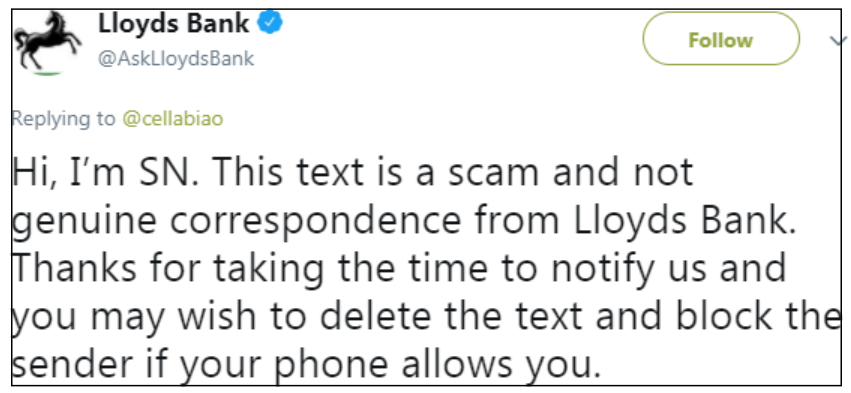
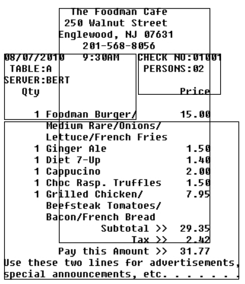
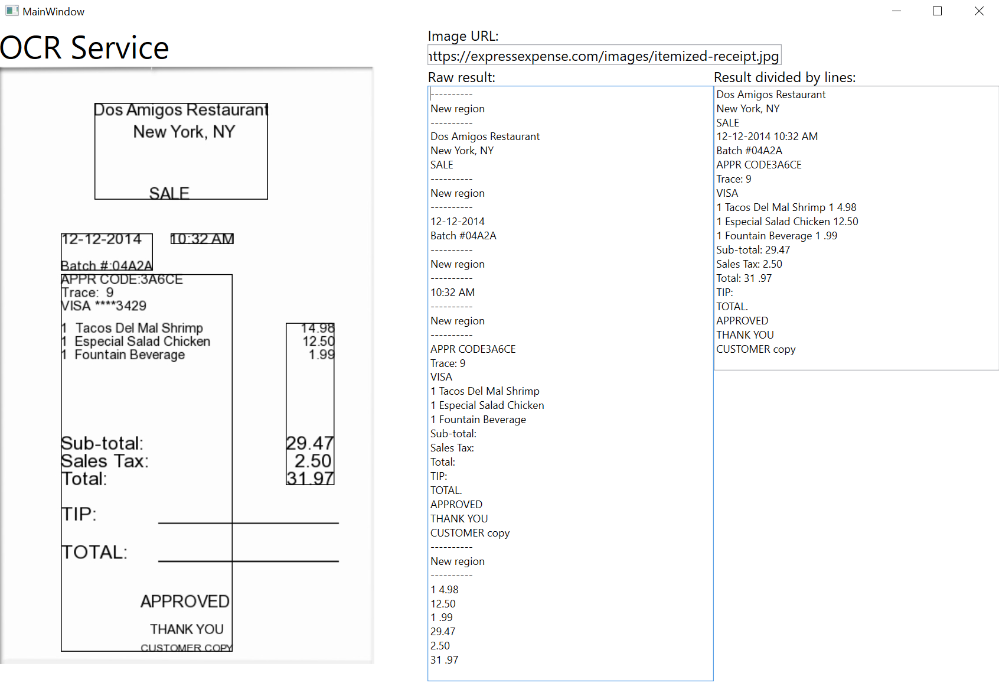

# CognitiveServices-OCRSamples
The intention of this repo is to build an OCR reader that transforms the OCR result to a single region separated by horizontal lines instead of separating the results into multiple regions that could be made of columns and/or rows depending on the grouping.

## How to use this sample ##
A Microsoft Azure account with a created Compute Vision service is needed to follow this sample. 

> NOTE: If you don't have an account yet you can create one for free on the [official page](https://azure.microsoft.com/en-us/).

To be able to run the source code it is needed to copy and paste the Vision service's URL and Key from the portal and paste it on the <b>App.config</b> file:
```xml
<?xml version="1.0" encoding="utf-8" ?>
<configuration>
    <startup> 
        // ... Some configuration values here
    </startup>
    <appSettings>
      <add key="ComputerVisionKey" value="yourComputerVisionKey"/>
      <add key="ComputerVisionUri" value="yourComputerVisionUriBase"/>
    </appSettings>
</configuration>
```

Note that the URL in the portal will look like this:

```console
https://[yourAzureRegion].api.cognitive.microsoft.com/vision/v1.0
```

Some parameters are also needed before pasting the URL to the config file. A language parameter set to unknown and a true flag for the service to detect the orientation of the image are added:

```console
/ocr?language=unk%26detectOrientation=true
```
So, the final URL on the <b>App.config</b> file should look like this:

```console
https://[yourAzureRegion].api.cognitive.microsoft.com/vision/v1.0/ocr?language=unk%26detectOrientation=true
```

## Regions vs horizontal lines ##
OCR service from Compute Vision returns a Json object with the following format:
- The identified language of the text,
- The text angle,
- Orientation from the text,
- A list of regions

The detailed explanation of each of these parameters can be found at the [REST API official documentation](https://westus.dev.cognitive.microsoft.com/docs/services/56f91f2d778daf23d8ec6739/operations/56f91f2e778daf14a499e1fc)

In short terms, a region is an identified group of lines that at the same time contains words. Depending on the image complexity, the regions might or might not represent the true order of the words. Below are two examples: 

### Easy scenario: ###


In this case, the service will only return one region that contains all the words in almost perfect order:

```console
0 
Lloyds Bank 
Follow 
@AskLloyds8ank 
Replying to @cellabiao 
Hi, I'm SN. This text is a scam and not 
genuine correspondence from Lloyds Bank. 
Thanks for taking the time to notify us and 
you may wish to delete the text and block the 
sender if your phone allows you. 
```

Only one region was identified:



### Not so easy scenario ###


Since the image above contains words in multiple columns and rows without an obvious order the service returns a confusing result:

```console
98/97/2919 
9:39RN 
SERUER:BERT 
Qty 
Foodman Burger/ 
The Foodner: Cefe 
25e Walnut Street 
Englewood, 
201-568-8056 
15 -eg 
1 .59 
2.09 
1.56 
7.95 
29.35 
2 .42
CHECK NO:91901 
PERSONS : gz 
Pritp
Medium Rare'ünion;j' 
Lettur.etFrenr.h Fries 
Ginger Rie 
Diet 7-1Jp 
Cappucino 
Choc Rasp. Truffles 
Beefsteak Tomatoes/ 
Bacon/French Bread 
Subtotal 
Tax 
Pay this Amount 
Use tnese two lines For advertisements, 
special announcements, pct.
```

So, how many regions were identified according to the service?



4 regions. Apparently ordered from top to bottom and left to right, which is good depending on if we want to discover regions or bad if we care only about the text and not the placing of it. 


## Converting regions to horizontal lines ##
Thus, trying to get the results line by line is not a straight forward scenario and that's why the <b>GetResultOrderedByLines</b> method is composed by 3 different methods:

```csharp
static class ConversionHelper
{
    internal static string GetResultOrderedByLines(List<Region> regions)
    {
        var words = SetLimitsInWords(regions);
        var linesByLeftLimit = GetLinesByLeftLimit(words);
        return ConstructStringFromLines(linesByLeftLimit);
    }
}
```

### SetLimitsInWords ###
The method iterates over every word in the result and converts it's <b>BoundingBox</b> parameter to 4 different values:
```console
BoundingBox = 200,260,300,75
```
- First value is pixel horizontal position considering the left margin as the start
- Second value is pixel vertial position considering the top margin as the start
- Third value is width of the word
- Fourth value is height of the word

After the conversion is done the method returns a list of Words containing every word identified in the service. No matter the region or original line. 

>Note that for the example only the first values of Top and Left margin are used.

### GetLinesByLeftLimit ###
Is a method that receives a list of words and returns a list of lines created by the similiraty of vertical positions of a group of words.
As an example: Let's consider the next words with their BoundingBoxes:
```console
- World (BoundingBox = 230, 179, 60, 75)
- Hello (BoundingBox = 150, 180, 60, 75)
- Vision (BoundingBox = 302, 252, 72, 74)
- From (BoundingBox = 150, 250, 48, 73)
- Compute (BoundingBox = 210, 247, 84, 74)
```

Given that both *Hello* and *World* words have a similar Top margin (180 and 179, respectively) then just a line with the words Hello and World will be returned.
Same with *From*, *Vision*, and *Compute* words. 

The method defines "similarity" as two words being having a difference of +/- 10 pixels in their Top margins. This because a photo is not exactly rectangular and perfectly aligned and so even if for your eyes two or more words are aligned, their top or left margins might not be the same.

After a new line is created from a set of words, said words are ordered by their left margin. This is done so the method doesn't return lines with words in an incorrect order. As the example of words above shows, instead of:

```console
New Line: World, Hello
New Line: Vision, From, Compute
```

The expect result should be:
```console
New Line: Hello, World
New Line: From, Compute, Vision
```

### ConstructStringFromLines ###
Finally, this method grabs a list of lines and creates a new string with all the words from each line and returns a string with the new format of horizontal lines.

### GetResultOrderedByRegions ###
Aditionally, there's this method that just iterates over each region, line and word to print the results line by line without any conversion (Mostly, to show the difference between an arranging of horizontal lines vs regions created by default and returned from the service)

## Result ##
